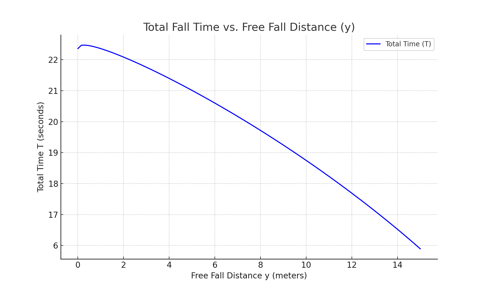

## Air Drop Design and Testing
The air drop system is designed to ensure consistent, safe, and accurate
delivery of payloads using a lightweight, efficient mechanism during autonomous missions. This year’s
payload consists of four GP908 strobe beacons, each housed in a
custom-designed 3D printed container (See next figure). These containers are compact,  impact-resistant,
and aerodynamically stable. the containers are secured to a drop mechanism weighing
less than 0.7 lb.

<figure>

<figcaption>Exploded view of the Air Drop mechanism, including the container and servo actuating mechanism assembly.</figcaption>
</figure>

Upon reaching the designated drop coordinates, the flight controller
sends a signal to a servo-actuated mechanism that releases the payload.
The drop mechanism transitions between two spooling stages. In the first
phase, the payload falls freely to gain momentum. Once a predefined
descent threshold is reached, the tether transitions to a secondary
braking spool, which slows the descent safely until touchdown.

To fine-tune drop timing and optimize descent speed, a relationship
between drop height and total fall time was modeled analytically and
experimentally. The chart in following figure outlines the established
correlation, enabling precise configuration of release height versus
desired impact velocity.

<figure>

<figcaption>Plotting the Total Fall Time vs Free Fall Distance.</figcaption>
</figure>

The drop system was subjected to extensive validation. Over 200 field
tests were conducted to evaluate deployment reliability, system
integrity, and positional accuracy of the payload upon landing. These
tests produced a success rate of 91% as shown in figure 9, defined as a successful payload
deployment without mechanical failure or entanglement.

<figure>

<figcaption>Bar chart of the number of successful and unsuccessful payload drop attempts during flight tests of the UAV Air Drop system.</figcaption>
</figure>

Statistical analysis of drop accuracy revealed a 90th percentile
distance from the target of just 2.26 feet, demonstrating the system’s
consistent precision. The previous two figures compare the cumulative distribution of
landing errors across all trials.

<figure>

<figcaption>Performance data gathered from testing the accuracy of the Air Drop mechanism</figcaption>
</figure>

<figure>

<figcaption>Measured deviations in ft. of object drop points from target coordinates.</figcaption>
</figure>

All air drop mechanisms are tested independently before full integration
to ensure compliance with mission safety standards. This quality
assurance protocol helps prevent hardware failure during flight and
ensures the UAV remains stable throughout the drop procedure as 

## Aircraft Design and Testing
Our UAV platform is based on a modified industrial-grade hexacopter,
customized to meet the SUAS competition’s demanding flight performance
requirements.
The vehicle features a __foldable frame__ designed to support a __13 lb payload__, a __range of up to 14 miles__, and a __maximum hovering endurance of 70 minutes__ under no-load conditions.

The frame was fabricated using a combination of **carbon fiber
composites** and **aluminum** to balance strength, rigidity, and
lightweight construction. This material choice ensures high
stiffness-to-weight ratio and robustness during landing and
transportation.

<figure>

<figcaption>Finite Element Analysis on system integration plate.</figcaption>
</figure>

## Dimensions and Mechanical Design
<figure>

<table>
<thead>
<tr class="odd">
<th style="text-align: center;">
<strong></strong>Dimensions
Data<strong></strong>
</th>
<th scope="row" style="text-align: center;">
<strong>Value</strong>
</th>
</tr></thead>

<tbody>
<tr class="even">
<th scope="row" style="text-align: center;">
Diagonal Length
</th>
<td style="text-align: center;">
1250 mm
</td>
</tr>
<tr class="odd">
<th scope="row" style="text-align: center;">
Arms
</th>
<td style="text-align: center;">
50 mm diameter, 495 mm long
</td>
</tr>
<tr class="even">
<th scope="row" style="text-align: center;">
Landing Gear
</th>
<td style="text-align: center;">
500 mm (20 inch) Carbon Fiber
tubes
</td>
</tr>
</tbody>
</table>

</figure>

Finite Element Analysis (FEA) was conducted using ANSYS to ensure
structural durability and minimise stress concentrations under dynamic
flight loading. **Topology optimisation** further reduced the
frame’s weight without compromising mechanical performance. Results of
this simulation are illustrated in the figure in [previous section](#aircraft-design-and-testing).

## Propulsion System
After evaluating several propulsion candidates, the **MN6007II
320KV** brushless motors were selected for their superior
thrust-to-efficiency performance. Each motor can generate up to
**12 lb of thrust**;, enabling robust lift capacity and flight
stability. This choice was validated by a comparative analysis of
theoretical flight times across multiple motors
(See upcoming table).

Paired with **22-inch carbon fiber propellers** (6.6-inch pitch)
and powered by **12 6S Li-ion battery packs** (54 Ah total
capacity), the system delivers high endurance and consistent flight
performance under varying payloads.

## Testing and Performance Evaluation
Flight testing was conducted over **40 individual missions**;,
accumulating more than **8 hours** of airtime under diverse
conditions. The UAV demonstrated consistent **top speeds up to 82
ft/s**;, a **hovering endurance of 45 minutes**;, and a
**payload capacity of 8 lb**;, as validated across multiple test
configurations (See bar chart).

<figure>

<table>
<thead>
<tr class="odd">
<th style="text-align: center;">
Technical Data
</th>
<th style="text-align: center;">
<strong>Value</strong>
</th>
</tr>
</thead>
<tbody>
<tr class="even">
<th scope="row" style="text-align: center;">
Motors
</th>
<td style="text-align: center;">
MN6007II, 320KV
</td>
</tr>
<tr class="odd">
<th scope="row" style="text-align: center;">
Propellers
</th>
<td style="text-align: center;">
22-inch Carbon Fiber, 6.6-inch
pitch
</td>
</tr>
<tr class="even">
<th scope="row" style="text-align: center;">
Battery Type
</th>
<td style="text-align: center;">
6S Li-ion
</td>
</tr>
</tbody>
</table>

</figure>

<figure>

<figcaption>Bar chart representing the Flight Performance test results.</figcaption>
</figure>

<figure>

<table>
<thead>
<tr class="odd">
<th style="text-align: center;">
<strong></strong>UAV
Metrics<strong></strong>
</th>
<th style="text-align: center;">
<strong>Results
Measured</strong>
</th>
</tr>
</thead>
<tbody>
<tr class="even">
<th scope="row" style="text-align: center;">
Number of Flights
</th>
<td style="text-align: center;">
40
</td>
</tr>
<tr class="odd">
<th scope="row" style="text-align: center;">
Flight Hours
</th>
<td style="text-align: center;">
8 hours
</td>
</tr>
<tr class="even">
<th scope="row" style="text-align: center;">
Top Speed
</th>
<td style="text-align: center;">
82 ft/s
</td>
</tr>
<tr class="odd">
<th scope="row" style="text-align: center;">
Payload
</th>
<td style="text-align: center;">
8 lb
</td>
</tr>
</tbody>
</table>

</figure>

The aircraft passed all **flight performance requirements** without
requiring mid-mission battery replacements, ensuring full mission
execution within a single power cycle. These results confirm that the
UAV is highly capable and well-suited for the competition mission
profile.
