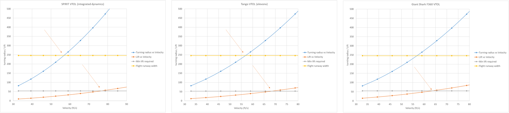
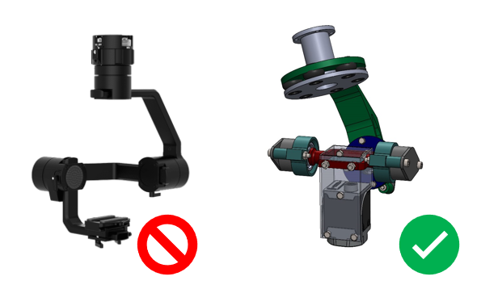

We considered multirotor, VTOL, and fixed-wing configurations.
Fixed-wing designs were rejected due to limited drop accuracy and ODLC
image quality. At the same time, VTOLs were dismissed because of their
large turning radius at high speeds and complex mode transitions.
Multirotors provided tight manoeuvrability, reliable payload deployment,
and better compatibility with the competition's confined airspace,
making them the optimal choice as shown in [@fig]:drone-config.

<figure>

<figcaption>
multi-rotor, VTOL, and fixed-wing
configurations.
</figcaption>
</figure>

\<fig:drone-config\>

<figure>

<figcaption>
Evaluated gimbal options. The passive gimbal option
(right) was chosen over the motorized version for its lightweight and
efficiency.
</figcaption>
</figure>

For the camera system, as in [@fig]:camera-gimbal, we evaluated using a
motorised gimbal, but ultimately chose a passive gimbal. The passive
design reduced the gimbal weight by over 50%, eliminated power
consumption, and improved flight endurance, making it more suitable for
our mission requirements.
