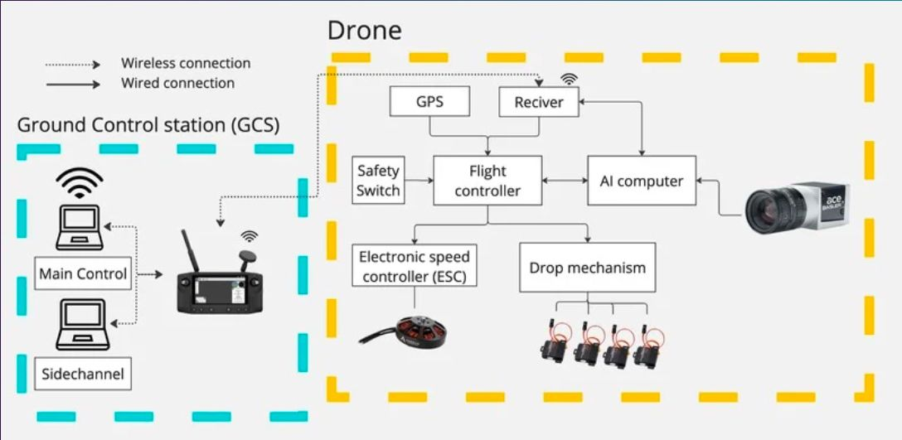
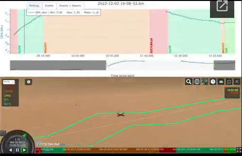
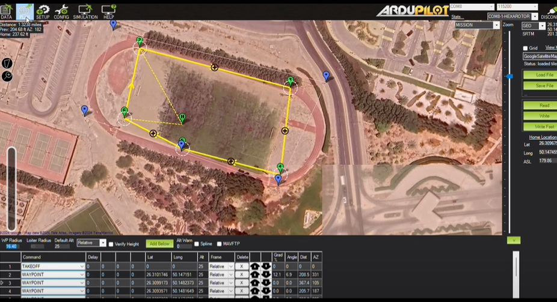

The flight control system of our hexacopter is centered around the
**Cube Orange+** flight controller running **ArduPilot firmware version
4.4.** This controller manages all core flight operations including
stabilization, navigation, and mode transitions.

A **Jetson Orin Nano** serves as the companion computer, responsible for
onboard processing tasks such as computer vision and telemetry
integration. The drone communicates with the ground control station via
a **Herelink RC system**, which handles both manual control and
telemetry streaming.

The **Ground Control Station (GCS)** is based on **Mission Planner**,
allowing for mission planning, parameter tuning, and live telemetry
monitoring.

These components work in tandem to provide exceptional reliability,
ensuring stable flight control and rapid recovery from unforeseen
events. The Cube Orange+ has been fully integrated with our ground
control systems to deliver seamless autonomous operations

<figure>

<figcaption>
Communication System Architecture.
</figcaption>
</figure>

The drone operates in two primary modes during the mission:

-   **AUTO Mode**: Used for fully autonomous waypoint-based missions.
    Once initiated, the drone navigates between pre-programmed
    waypoints, performs tasks like imaging or object detection, and
    returns to launch autonomously.

-   **LOITER Mode**: Used for manual intervention. The safety pilot can
    transition to Loiter mode via the RC controller in case of anomalies
    or required human override. This mode stabilizes the drone's
    position using GPS and altitude hold, allowing safe manual control.

Mode transitions are explicitly controlled by the **Herelink RC system**
to ensure quick and reliable intervention during autonomous operations.

Using the **Mission Planner** software suite, our team precisely
configures and tunes critical flight parameters such as approach
velocity, return-to-launch altitude, and geofencing limits. This
platform also supports live telemetry monitoring, log-based diagnostics,
and in-flight tuning.

## Flight Testing Overview

Over the past year, we have conducted a total of **40 flight tests**;,
**10 of which were manually piloted** to validate fallback procedures
and hardware redundancy. Manual flights averaged **12 minutes** in
duration, while **30 autonomous flights** made up the majority of
testing. This accumulated to **485 total flight minutes**;, of which
**363 minutes were fully autonomous**.

Through rigorous field evaluations and extensive log-based review, our
autopilot demonstrated strong compatibility with the mission planner,
telemetry systems, and RC override. During autonomous missions, we
configured waypoint sequences using the mission planner and evaluated
positional accuracy through telemetry logs

<figure>

<table>
<tbody>
<tr class="odd">
<td style="text-align: left;">
<strong>Flight
Statistic</strong>;
</td>
<td style="text-align: left;">
<strong>Value</strong>
</td>
</tr>
<tr class="even">
<td style="text-align: left;">
Total Flights
</td>
<td style="text-align: left;">
40
</td>
</tr>
<tr class="odd">
<td style="text-align: left;">
Manual Flights
</td>
<td style="text-align: left;">
10
</td>
</tr>
<tr class="even">
<td style="text-align: left;">
Average Manual Flight Time
</td>
<td style="text-align: left;">
12 minutes
</td>
</tr>
<tr class="odd">
<td style="text-align: left;">
Total Flight Time
</td>
<td style="text-align: left;">
485 minutes
</td>
</tr>
<tr class="even">
<td style="text-align: left;">
Autonomous Flight Time
</td>
<td style="text-align: left;">
363 minutes
</td>
</tr>
</tbody>
</table>

<figcaption>
Summary of Autopilot Testing Flights
</figcaption>
</figure>

<figure>

<figcaption>
Log viewer visualization of real-time autopilot
data.
</figcaption>
</figure>

## Waypoint Tracking and Navigation Accuracy

A total of **600 waypoints** were executed throughout the flight testing
phase, averaging **20 waypoints per autonomous flight**;. The system
maintained a **100% waypoint hit rate**;, and onboard telemetry revealed
**negligible average waypoint miss error**;, indicating consistent
navigational precision.

<figure>

<figcaption>
Cumulative waypoint success metrics across autonomous
flights.
</figcaption>
</figure>

Waypoints are uploaded using **Mission Planner** prior to the mission.
The flight plan is designed to comply with mission constraints and
objectives, including obstacle avoidance, search patterns, and target
acquisition zones.

The drone utilizes GPS and inertial measurements to follow the waypoints
with precision. Navigation parameters such as **WP_RADIUS**, and
**LOITER_RADIUS** were tuned to achieve stable and accurate path
following during flight tests. These results confirm the robustness of
the Cube Orange+ as a reliable and high-performance solution for the
SUAS competition, ensuring precision guidance and safe operation across
all mission phases.

## Flight Stability and Control {#Flight-Stability-and-Control}

Flight stability is maintained through ArduPilot's onboard PID
controllers for roll, pitch, yaw, and altitude. Tuning was conducted
through a combination of simulation (SITL) and real-world testing,
optimizing the balance between responsiveness and stability.

Motor mixing and frame geometry were configured specifically for the
hexacopter layout (X configuration), ensuring even thrust distribution
and yaw authority.

Stability was validated using flight logs analyzed via Mission Planner
and ArduPilot log review tools, confirming minimal oscillations and
consistent altitude hold under varying conditions.

## Safety and Redundancy {#Safety-and-Redundancy}

The following failsafe mechanisms were configured and tested:

- **RC Failsafe**: Automatically triggers Return-to-Launch (RTL) on
  loss of RC signal.
- **Battery Failsafe**: Initiates RTL or LAND if voltage or current
  drops below set thresholds.
- **GPS Failsafe**: Triggers mode switch or loiter hold if GPS signal
    is lost or degraded.

Manual override is always available via the Herelink system, allowing
the safety pilot to take control instantly in case of anomalies.
