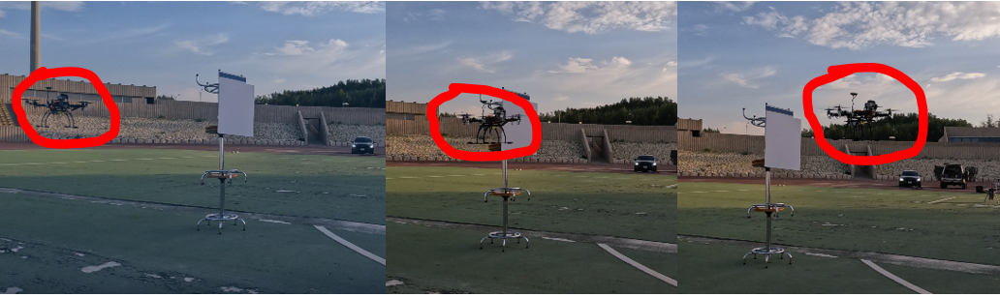
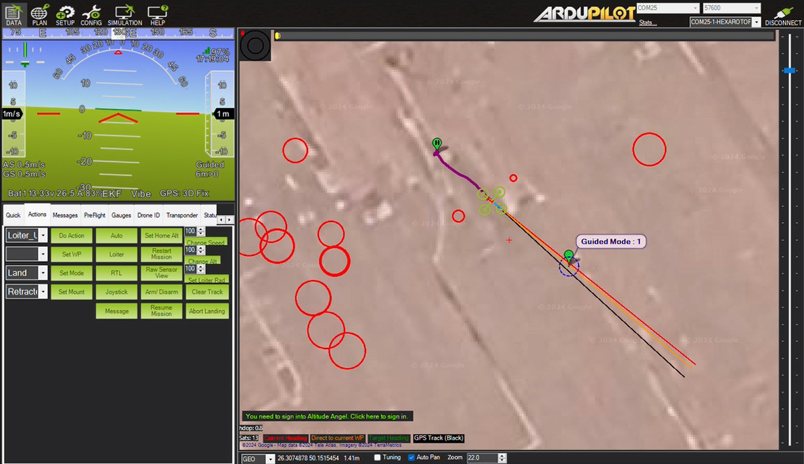

Our UAV is equipped with the **RPLidar A2 sensor**;, a lightweight and
fast-scanning LiDAR designed specifically for aerial obstacle avoidance
applications. The sensor features a rotating disc mechanism capable of
generating a 2D planar scan at a rapid update rate. With the RPLidar A2,
the UAV continuously scans its surroundings and updates its obstacle map
every **100 ms**;. This high-frequency update cycle enables quick
response to fast-approaching obstacles, enhancing flight safety and
navigational autonomy.

## Bendy Ruler Algorithm for Dynamic Obstacle Avoidance

For dynamic obstacle avoidance, our system employs the **horizontal
Bendy Ruler algorithm**;. This strategy enables the UAV to immediately
sidestep incoming obstacles horizontally and pivot around them,
minimising the risk of collision. we selected the horizontal variant
over the vertical Bendy Ruler to avoid the complexities associated with
predicting the pitch and roll attitudes of fast-moving aerial objects. A
demonstration of this maneuver is shown in [@fig]:obstacle-avoidance.

<figure>

<figcaption>
Sequential images show the UAV dynamically adjusting its
flight path to avoid an obstacle during field testing.
</figcaption>
</figure>

To complement real-world testing, we also validated the obstacle
avoidance strategy through mission planner simulations, as shown in
Figure [16](#bendy_mission_planner).

<figure>

<figcaption>
bendy mission planner
</figcaption>
</figure>

## Sensor Placement and System Optimization

To maximize field-of-view and minimize signal interference, the RPLidar
sensor is **mounted atop the UAV airframe**;. This placement ensures an
unobstructed scanning environment while avoiding disruptions to the GPS
signal --- crucial for maintaining high-accuracy positional tracking
during obstacle avoidance maneuvers.

The integration of the RPLidar A2 sensor, the real-time scanning
capabilities, and the efficient obstacle avoidance strategy ensures the
UAV's capability to safely navigate through complex and dynamic aerial
environments.
